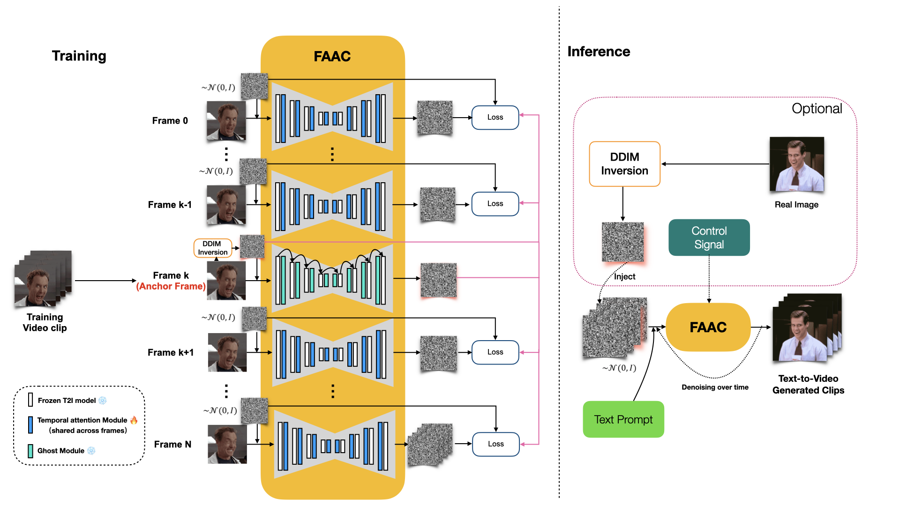

#    

FAAC: Facial Animation Generation with Anchor Frame and Conditional Control for Superior Fidelity and Editability
=================================================================================================================

FAAC
----



Abstract
--------

Over recent years, diffusion models have facilitated significant advancements in video generation. Yet, the creation of face-related videos still confronts issues such as low facial fidelity, lack of frame consistency, limited editability and uncontrollable human poses. To address these challenges, we introduce a facial animation generation method that enhances both face identity fidelity and editing capabilities while ensuring frame consistency. This approach incorporates the concept of an anchor frame to counteract the degradation of generative ability in original text-to-image models when incorporating a motion module. We propose two strategies towards this objective: training-free and training-based anchor frame methods. Our method's efficacy has been validated on multiple representative DreamBooth and LoRA models, delivering substantial improve ments over the original outcomes in terms of facial fidelity, text-to-image editability, and video motion. Moreover, we introduce conditional control using a 3D parametric face model to capture accurate facial movements and expressions. This solution augments the creative possibilities for facial animation generation through the integration of multiple control signals.

🎬   Personalized Facial Animation   🎬
=======================================

For best and full view, please refer to the folder ```FAAC_results/main_results```.

 We select four representative LoRA character and perform personalized facial animation.  Each line represents a different LoRA character (from top to bottom:  Liam Neeson, Asian Girl, Suriya Sivakumar, Angelina Joile). For each LoRA character, we have employed three prompts to generate facial animations. The prompt corresponding to each video clip is annotated below it. Our FAAC works effectively and generate frame-consistent results on diverse characters and prompts. Moreover, two advantages of FAAC can be reflected in the above results: (1) face identity fidelity (2) editing capabilities by text prompts. Due to our key-frame strategy, we can better maintain fidelity to characters and text prompt, without being compromised by the motion module.

| Character        | Result - 1                                                   | Result - 2                                                   | Result - 3                                                   |
| ---------------- | ------------------------------------------------------------ | ------------------------------------------------------------ | ------------------------------------------------------------ |
| Liam Neeson      |  |  |  |
|                  | **A close-up shot of a guy with a relaxed and easygoing expression** | **A man, wearing a hat, against a beach background**         | **A man with a confident smile, making eye contact with the camera** |
| Asian Girl       |  |  |  |
|                  | **A portrait of a woman in a natural setting, wearing a headband** | **A close-up shot of a girl with glasses and earrings**      | **A girl adorned with a colorful tattoo on the cheek**       |
| Suriya Sivakumar |  |  |  |
|                  | **A man with a goatee and a leather cowboy hat**             | **A man with a piercing gaze against a backdrop of mountain peaks** | **A man with a surprised and delighted expression, showcasing a moment of unexpected joy** |
| Angelina Joile   |  |  |  |
|                  | **A beautiful woman starts to talk, bright, beautiful face, realistic, solo** | **A close-up shot of a woman with elegant pearl earrings and a vintage hairstyle** | **A close-up shot of a woman with vibrant, multicolored hair** |

🎞   Control Results   🎞
=========================

For best and full view, please refer to the folder ```FAAC_results/control_results```.

We demonstrate our FAAC-with-control results.  We select four representative driving templates, including  common facial movements such as opening the mouth, blinking, turning the head, and their combinations. Each line represents a different driving template. Then we use the driving template to control the facial animation results, assisted by the text prompt. The specific control method is mentioned in the paper.  The text prompt corresponding to each video clip is annotated below it. The above results indicate that we can generate controllable facial animations with targeted motion patterns.

|              |                                                              | Result - 1                                                   | Result - 2                                                   |
| ------------ | ------------------------------------------------------------ | ------------------------------------------------------------ | ------------------------------------------------------------ |
| Template - 1 |  |  |  |
|              | **Driving Template**                                         | **a close-up shot of a woman with vibrant, multicolored hair** | **A man with a goatee against a backdrop of mountain peaks** |
| Template - 2 |  |  |  |
|              | **Driving Template**                                         | **a woman, elegant angel, crown on the head, wings on the back, in a floral garden setting** | **A portrait of a face against a brick wall, wearing a bandana** |
| Template - 3 |  |  |  |
|              | **Driving Template**                                         | **A portrait of a man with a goatee, wearing a plaid shirt and surrounded by autumn leaves** | **A portrait of a face against a graffiti-covered wall, wearing a necklace** |
| Template - 4 |  |  |  |
|              | **Driving Template**                                         | **A girl is smiling, bright, beautiful-face,realistic,solo** | **A portrait of a guy with a handlebar mustache, wearing a vintage pilot's jacket** |

## Some Additional Results For Rebuttal

 ### Range of Motion

Even without additional control, the video clips we generate possess dynamism, including the movement of characters and changes in camera perspective. We present more examples when our method exhibits a greater range of motion compared to other approaches under the same prompt, LoRA, DreamBooth and so on.

|                | AnimateDiff                                                  | FAAC (Our Method)                                            |
| -------------- | ------------------------------------------------------------ | ------------------------------------------------------------ |
| Comparison - 1 |  |  |
|                | **A portrait of a girl against a brick wall, wearing a bandana** | **A portrait of a girl against a brick wall, wearing a bandana** |
| Comparison - 2 |  |  |
|                | **A portrait of a girl against a brick wall, wearing a bandana** | **A portrait of a girl against a brick wall, wearing a bandana** |
| Comparison -3  |  |  |
|                | **a woman, tilt her head, wearing a hat, against a beach background** | **a woman, tilt her head, wearing a hat, against a beach background** |
| Comparison - 4 |  |  |
|                | **A man with a confident and charismatic smile, making eye contact with the camera** | **A man with a confident and charismatic smile, making eye contact with the camera** |
| Comparison -5  |  |  |
|                | **A man with a confident and charismatic smile, making eye contact with the camera** | **A man with a confident and charismatic smile, making eye contact with the camera** |

### fine-grained control of facial expressions

We demonstrate that our method provides more fine-grained control over facial expressions, such as improved control over **blinking eyes**. This is reflected in two aspects: 

(1) Achieving better facial expression editing solely through prompts, without the need for additional control modules. 

(2) Utilizing additional control modules to achieve a more controllable outcome.

|                                                    | AnimateDiff                                                  | FAAC (Our Method)                                            |
| -------------------------------------------------- | ------------------------------------------------------------ | ------------------------------------------------------------ |
| Comparison - 1<br />(edit eyes by prompts)         |  |  |
|                                                    | A close-up shot of a man with a mischievous grin and **raised eyebrows** | A close-up shot of a man with a mischievous grin and **raised eyebrows** |
| Comparison - 2 <br />(edit eyes by control signal) |  |  |
|                                                    | A portrait of a girl against a brick wall, wearing a bandana | A portrait of a girl against a brick wall, wearing a bandana<br />**+ a blinking eyes driving template** |

